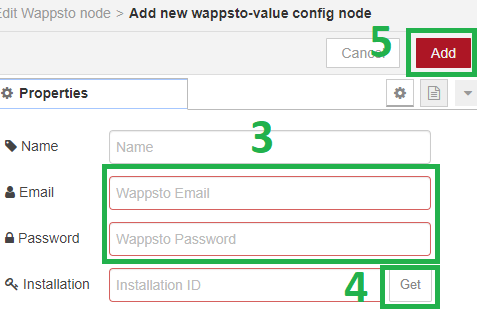
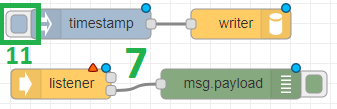
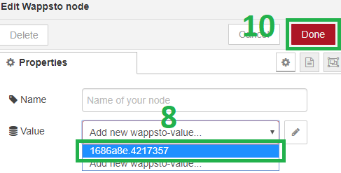

# node-red-contrib-wappsto

This module wil help your apps and devices to work together in new interesting ways. It provides a set of Node-RED nodes that enable communication with [Wappsto](https://wappsto.com/), as all the necessary API calls are nicely wrapped by the given nodes.

# Table of Contents
1. [Prerequisites](#prerequisites)
2. [Installing](#installing)
3. [Getting started](#getting-started)
4. [Create your first flow](#create-your-first-flow)
5. [Weather flow example](#weather-flow-example)
6. [Manage nodes from Wappsto](#manage-nodes-from-wappsto)
7. [Upload your flows](#upload-your-flows)
8. [License](#license)

## Prerequisites

Before you start, you need first:
  * a [Wappsto](https://wappsto.com/register) account (is free);
  * [Node.js](https://nodejs.org/en/) and [npm](https://www.npmjs.com/) installed on your computer. If you don't have them, you can use e.g. [nvm](https://github.com/nvm-sh/nvm) or [n](https://github.com/tj/n) to get them easily installed on your computer;
  * and [Node-RED](https://nodered.org/docs/getting-started/installation).

There are at least two ways to install Node-RED:

### 1. package.json (faster)

Download [this file](weather_example/background/package.json) and run in the same directory where you placed the "*package.json*" file the following command:

```
npm install
```

This file also includes all the used nodes in this guide, thus the [Installing](#installing) section and `openweathermap` node installation can be skiped. Feel free to add [additional nodes](https://flows.nodered.org/?sort=rating&type=node&num_pages=1).

### 2. npm

According to [Node-RED docs](https://nodered.org/docs/getting-started/installation), you can simply execute the following command to install Node-RED package globally on your computer:

```
sudo npm install -g --unsafe-perm node-red
```

## Installing

Install the Wappsto nodes by either:

* using the following command in your `~/.node-red` installation directory:

  ```
  npm install node-red-contrib-wappsto
  ```

* or using Node-RED Install Pallet, look for "*node-red-contrib-wappsto*".

## Getting started

### 1. Run Node-RED

If you've chosen the "*package.json*" installation approach, then execute `npm start` command, otherwise `node-red` in your terminal to run it. When that is done, to access Node-RED dashboard, open your web browser and go to this address: http://localhost:1880.

If you installed this package while Node-RED was running, remember to restart Node-RED and refresh the dashboard (press F5 key) to see the newly installed nodes.  

### 2. Locate Wappsto nodes

This package comes with two nodes:

* `listener` - listens for stream events coming from Wappsto and outputs a message so that wired nodes can act upon it.

* `writer` - sends data from wired nodes to Wappsto.

The `listener` node (1) can be found under the "*input*" category whereas the `writer` node (2) under the "*output*" category.

<div align="center">
  
</div>

## Create your first flow

This section describes a very basic scenario on how you can pass data throught Wappsto.

### 1. Sending data to Wappsto

Add `inject` and `writer` nodes to the canvas and wire them together (1). Next, click on the `writer` node to open the editing view and add a new "*Value*" (2). Once you enter the "*Value*" view, provide your Wappsto email and password (3), and click the "*Get*" button (4) to retrieve a new installation ID. Then click `Add > Done` buttons (5-6) to exit the editing mode.

<div align="center">
  
  
  
</div>

### 2. Receiving data from Wappsto

In order to receive and see the injected data, add `listener` and `debug` nodes to the canvas and wire the `debug` node to the second pin of the `listener` (7). Open the `listener` node editing view and select the previously created "*Value*" (8). Last but not least, click the `Done > Deploy` buttons (9-10).

<div align="center">
  
  
  
</div>

Click on the `inject` node (11) and go to the "*Debug*" tab to see the injected timestamp (12).

## Weather flow example

This flow example extends the previous scenario by adding an `openweathermap` [node](https://flows.nodered.org/node/node-red-node-openweathermap) and 2 core "*function*" nodes to the flow.

### 1. Prerequisites

* You need to have the weather node installed, e.g. execute the following command in your `~/.node-red` directory:

  ```
  npm install node-red-node-openweathermap
  ```

  Remember to restart Node-RED and refresh your web browser to see the `openweathermap` nodes.

* Get an [OpenWeatherMap API key](https://home.openweathermap.org/api_keys).

### 2. Import the example

Copy the content of [this file](weather_example/background/flows.json), paste it to `Settings > Import > Clipboard` (press Ctrl+I keys to quickly open it) input field, click the "*Import*" button, and open the "*Weather*" tab (1).

Rember to replace "*email*" and "*password*" with your Wappsto credenitals and get a new installation ID. Use the same ID in both of the "*Values*". Also, place the API key into the `openweathermap` node.

<div align="center">
  
</div>

You're ready to deploy and play around!

## Manage nodes from Wappsto

Behind the scenes, to enable the communication with Wappsto, the nodes will create a couple of data structures that are part of our [Unified Data Model](https://developer.wappsto.com/), that is: `Network > Device > Value > State`. Each node in this schema represents a "*Value*". The created schema and its data can be accessed and managed using e.g. [My Data](https://store.wappsto.com/application/my_data) wapp.

In the case of the weather example, using the "*My Data*" wapp, the location can be changed and you can see the reported temperature.

## Upload your flows

Apart from providing the connectivity, this packages enables to run Node-RED flows in Wappsto. To upload the flows and make them running, it is enough to click the "*Upload flows to Wappsto*" button (1). To see and edit the exported files, go to [Wapp Creator](https://store.wappsto.com/application/wapp_creator) and click on the "*Node-RED*" application (2).

<div align="center">
  
  
</div>

To run Node-RED flows in Wappsto, the [*main.js*](weather_example/background/main.js) file includes these lines:

```javascript
const RED = require('node-red-contrib-wappsto/red');
```

It creates a wrapper for Node-RED runtime. Aside from exposing the runtime object, it gives possibility to modify the [Runtime Configuration](https://nodered.org/docs/configuration) with ease. Before you start the runtime, you can modify `RED._settings` object to apply your own configuration.

The next crucial line is:

```javascript
RED.start({ flows: ..., credentials: ... });
```

it accepts an object as argument with the following keys:
* `flows` (object): Node-RED flows.
* `credentials` (object): decoded flows credentials.

It runs or restarts Node-RED runtime with the provided arguments and returns a `Promise` object so that you can chain `than` function.

Try to make your own modifications to the files and play around. This is just the beginning!

## License

Apache 2.0 © [Seluxit A/S](http://seluxit.com)
